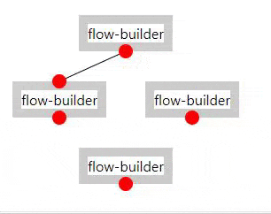

# flow builder

```
$ npm install && npm start
```



### TODO

- [ ] *add/remove edges
- [ ] *add/remove nodes
- [ ] *custom node content
- [ ] *grouping
- [ ] *style customization (border, bg, padding?)
- [ ] nesting flows
- [ ] bezier curve paths (2 control points)
  - How should node sizing work in this case?
- [ ] memoize path calculation
- [ ] separate x/y rounding mode dependant on initial node quadrant
